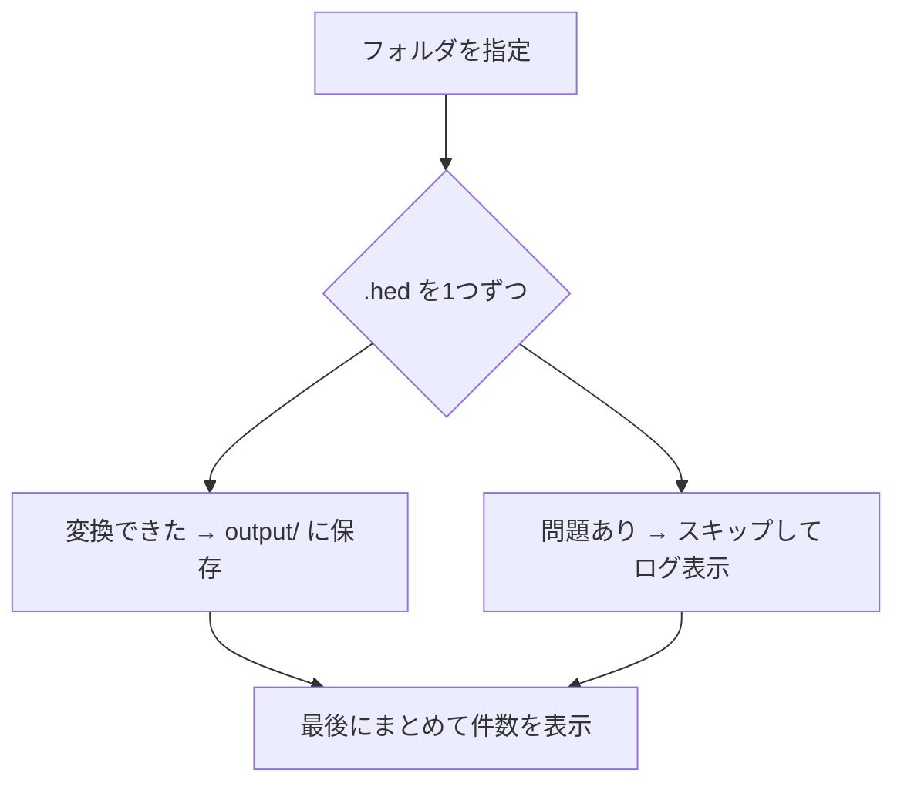
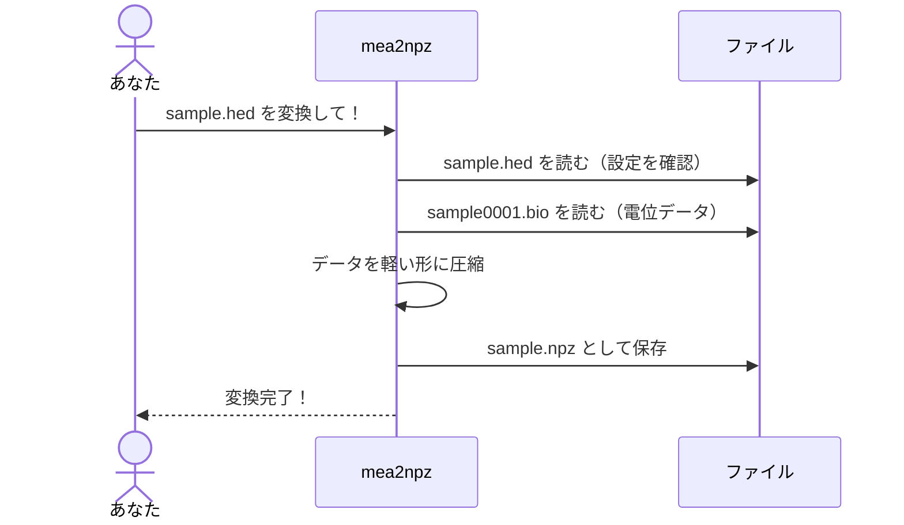
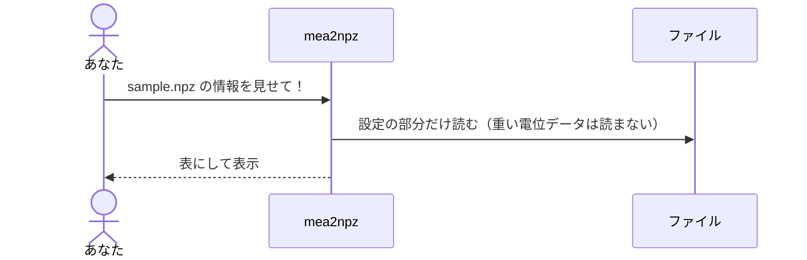

# mea2npz かんたんマニュアル

> **このマニュアルについて**
> プログラミングが初めての方でも使えるように、`mea2npz` というツールの使い方を
> ステップごとに説明します。専門用語にはそのつど説明をつけています。
> まずは「[3. インストール](#3-インストール)」→「[4. いちばん簡単な使い方（対話モード）](#4-いちばん簡単な使い方対話モード)」だけ読めば使い始められます。

---

## 目次

1. [このツールでできること](#1-このツールでできること)
2. [用語をやさしく説明](#2-用語をやさしく説明)
3. [インストール](#3-インストール)
4. [いちばん簡単な使い方（対話モード）](#4-いちばん簡単な使い方対話モード)
5. [コマンドで使う（慣れてきたら）](#5-コマンドで使う慣れてきたら)
6. [フォルダごとまとめて変換する](#6-フォルダごとまとめて変換する)
7. [.npz ファイルの中身を確認する](#7-npz-ファイルの中身を確認する)
8. [変換した .npz を Python で読む](#8-変換した-npz-を-python-で読む)
9. [中で何が起きているの？（処理の流れ）](#9-中で何が起きているの処理の流れ)
10. [困ったとき（エラー別）](#10-困ったときエラー別)
11. [用語集](#11-用語集)

---

## 1. このツールでできること

MEA（多点電極アレイ）の計測でできる `.hed` / `.bio` ファイルは、**サイズが大きい**ので
持ち運びや保存が大変です。`mea2npz` は、これを**軽い `.npz` ファイルに変換**するツールです。


**うれしいポイント**

- **Python のインストールが不要**。`mea2npz` という1つのファイル（実行ファイル）を置くだけで動きます。
- **Windows / Mac / Linux のどれでも動く**。
- 変換した `.npz` は、研究で使っている **pyMEA でそのまま読めます**（中身の数値も完全に同じ）。

---

## 2. 用語をやさしく説明

| 言葉 | かんたんな意味 |
|---|---|
| **MEA** | たくさんの電極で細胞の電気信号を測る装置。 |
| **`.hed` ファイル** | 計測の設定（サンプリングレートや増幅率）が入った小さなファイル。 |
| **`.bio` ファイル** | 実際の電位データ（数字の大きなかたまり）。`.hed` と同じ名前 + `0001.bio`。 |
| **`.npz` ファイル** | 変換後の軽いファイル。中身は `.hed`/`.bio` と同じ情報を圧縮したもの。 |
| **サンプリングレート** | 1秒間に何回測ったか（Hz）。例: 5000Hz = 1秒に5000回。 |
| **GAIN（ゲイン）** | 信号をどれくらい増幅したか。 |
| **電極間距離** | 電極どうしの間隔（μm = マイクロメートル）。 |
| **ターミナル** | コマンドを打つ黒い画面。Windows では **git bash** を使います。 |
| **コマンド** | ターミナルに打ち込む命令文のこと。 |

> 💡 `.hed` と `.bio` は**セットで1つの計測**です。`mea2npz` には `.hed` を渡せば、
> 同じ名前の `.bio` を自動で探して読み込みます。

---

## 3. インストール

### Windows の方

1. **git bash** を開きます（スタートメニューで「git bash」と検索）。
2. 下のコマンドを**コピーして貼り付け**、Enter を押します（最初の1回だけ）。

```bash
curl -fsSL https://raw.githubusercontent.com/kkito0726/MEA_modules/main/tools/mea2npz/install.sh | bash
```

3. 「インストール完了」と出たら、**git bash を一度閉じて開き直します**。
4. 確認のため、次を打って文字が出れば成功です。

```bash
mea2npz -version
```

### Mac / Linux の方

ターミナルを開いて、同じコマンドを実行します。

```bash
curl -fsSL https://raw.githubusercontent.com/kkito0726/MEA_modules/main/tools/mea2npz/install.sh | bash
```

> ⚠️ Mac で「開発元を確認できないため開けません」と出たら、いったん
> `xattr -d com.apple.quarantine ~/bin/mea2npz` を実行してから使ってください。

---

## 4. いちばん簡単な使い方（対話モード）

**おすすめはこれです。** コマンドの細かいオプションを覚えなくても、質問に答えるだけで変換できます。

ターミナルで、ツール名だけを打って Enter:

```bash
mea2npz
```

すると、ロゴと一緒に質問が順番に出てきます。**何も入力せず Enter を押すと、かっこ内の初期値**が使われます。

```
███╗   ███╗███████╗ █████╗ ██████╗ ███╗   ██╗██████╗ ███████╗
████╗ ████║██╔════╝██╔══██╗╚════██╗████╗  ██║██╔══██╗╚══███╔╝
██╔████╔██║█████╗  ███████║ █████╔╝██╔██╗ ██║██████╔╝  ███╔╝
██║╚██╔╝██║██╔══╝  ██╔══██║██╔═══╝ ██║╚██╗██║██╔═══╝  ███╔╝
██║ ╚═╝ ██║███████╗██║  ██║███████╗██║ ╚████║██║     ███████╗
╚═╝     ╚═╝╚══════╝╚═╝  ╚═╝╚══════╝╚═╝  ╚═══╝╚═╝     ╚══════╝
 :: .hed/.bio → .npz converter ::   v0.1.0

mea2npz 対話モード — 各項目は Enter で既定値を採用します。
入力パス (.hed ファイル or ディレクトリ): /Users/you/data/sample.hed
保存dtype (int16/float32) [int16]:        ← Enter でOK
読み込み時間を指定する [Y/n]: n            ← 全部変換するなら n
電極間距離 (μm) [450]:                     ← Enter でOK
時刻を 0s にリセットする [Y/n]:            ← Enter でOK
出力先 — 空で既定:                         ← Enter でOK
変換完了: /Users/you/data/sample.npz
```

これで、`sample.hed` と同じ場所に **`sample.npz`** ができます。

> 💡 **入力パスの簡単な入れ方**: ファイルをターミナルの画面に**ドラッグ＆ドロップ**すると、
> パス（ファイルの場所）が自動で入力されます。

### 質問の意味

| 質問 | 意味 | 迷ったら |
|---|---|---|
| 入力パス | 変換したい `.hed` ファイルの場所 | （必須） |
| 保存dtype | 圧縮の方式。`int16`=軽い / `float32`=やや大きい | `int16`（Enter） |
| 読み込み時間を指定する | 一部の時間だけ切り出すか | `n`（全部） |
| （指定する場合）開始秒・終了秒 | 何秒から何秒までか | 例: 0 と 60 |
| 電極間距離 | 電極の間隔(μm) | `450`（Enter） |
| 時刻を 0s にリセット | 切り出した部分を「0秒スタート」にするか | Enter（する） |
| 出力先 | 保存先。空なら入力と同じ場所 | Enter |

---

## 5. コマンドで使う（慣れてきたら）

慣れてきたら、質問に答えずに一発で変換できます。

```bash
# いちばん基本（全部を int16 で変換）
mea2npz sample.hed

# 30秒〜60秒だけ切り出す
mea2npz sample.hed -start 30 -end 60

# float32 で保存する
mea2npz sample.hed -dtype float32
```

主なオプション（`-`ではじまる追加の指定）:

| オプション | 意味 | 初期値 |
|---|---|---|
| `-start <秒>` | 何秒から読むか | 0 |
| `-end <秒>` | 何秒まで読むか | 最後まで |
| `-dtype int16\|float32` | 圧縮方式 | int16 |
| `-distance <μm>` | 電極間距離 | 450 |
| `-o <場所>` | 出力先を指定 | 入力と同じ場所 |
| `-keep-time` | 時刻をリセットしない | （既定はリセット） |

困ったら次でヘルプが出ます。

```bash
mea2npz -h
```

---

## 6. フォルダごとまとめて変換する

`.hed` がたくさんあるフォルダを渡すと、**中身を全部まとめて変換**します。

```bash
mea2npz ./measurements
```

- 変換結果は、そのフォルダの中に **`output` フォルダ**ができて、その中に入ります。
- もし途中に変換できないファイルがあっても、**止まらずに飛ばして続けます**。
- 最後に「成功 / スキップ / 失敗」の件数が表示されます。



> サブフォルダの中まで探したいときは `-recursive` を付けます。
> ```bash
> mea2npz ./measurements -recursive
> ```

---

## 7. .npz ファイルの中身を確認する

「この `.npz` ってどんな設定で測ったんだっけ？」を確認できます。`.npz` を渡すだけです。

```bash
mea2npz sample.npz
```

表で情報が出ます。

```
ファイル情報: sample.npz
┌─────────────────────────┬───────┐
│ 項目                    │ 値    │
├─────────────────────────┼───────┤
│ 電極間距離 (um)         │ 450   │
│ サンプリングレート (Hz) │ 5000  │
│ GAIN                    │ 50000 │
│ 計測時間 (s)            │ 1     │
│ dtype                   │ int16 │
└─────────────────────────┴───────┘
```

> このとき `.npz` は**変換されません**。中身を見るだけなので安全です。

---

## 8. 変換した .npz を Python で読む

研究で使う pyMEA では、`.npz` を次のように読み込めます（`.hed` を読むのとほぼ同じ）。

```python
from pyMEA import read_MEA_npz

mea = read_MEA_npz("sample.npz")
print(mea.data.array.shape)   # (65, データ数) … 1行目は時刻、2行目以降が各電極
```

`mea2npz` が作った `.npz` は、pyMEA が作るものと**中身の数値が完全に同じ**なので、
これまでの解析コードがそのまま使えます。

---

## 9. 中で何が起きているの？（処理の流れ）

「変換ボタンを押すと中で何が起きるか」をざっくり図にすると、こうなります。



`.npz` の情報を見るとき（[7章](#7-npz-ファイルの中身を確認する)）は、こうです。



---

## 10. 困ったとき（エラー別）

| 出たメッセージ・症状 | 原因 | 対処 |
|---|---|---|
| `command not found: mea2npz` | インストール直後でターミナルが古い状態 | ターミナルを**開き直す**。それでもダメなら[インストール](#3-インストール)をやり直す |
| `.bio が見つかりません` | `.hed` と同じ場所に `.bio` が無い | `.hed` と `○○0001.bio` が**同じフォルダ**にあるか確認 |
| `end=○○s がデータ長を超えています` | 計測時間より長い区間を指定した | `-end` を短くする、または時間指定をやめる（全部変換） |
| `dtype は int16 または float32 を…` | `-dtype` の打ち間違い | `int16` か `float32` のどちらかにする |
| （Mac）開けません/壊れている | 署名のない実行ファイルの警告 | `xattr -d com.apple.quarantine ~/bin/mea2npz` を実行 |
| （Windows）SmartScreen の警告 | 同上 | git bash から実行していれば基本出ません。出たら「詳細情報→実行」 |
| フォルダ変換で一部 `[SKIP]` と出た | そのファイルに問題があった | スキップされたファイル名がログに出るので、そのファイルだけ確認 |

> エラーメッセージは**赤い画面ではなく、ふつうの文字**で出ます。落ち着いて文章を読めば、
> たいてい原因が書いてあります。

---

## 11. 用語集

- **実行ファイル / バイナリ**: そのままダブルクリックやコマンドで動くプログラム本体。`mea2npz` がこれ。
- **パス**: ファイルの「住所」。例: `/Users/you/data/sample.hed`。
- **オプション / フラグ**: コマンドに付ける追加指定。`-start 30` のように `-` で始まる。
- **dtype**: データの保存方式。`int16`（軽い・無損失）/ `float32`（やや大きい・実質無損失）。
- **対話モード**: 質問に答えていくだけで使えるモード（[4章](#4-いちばん簡単な使い方対話モード)）。
- **一括変換 / バッチ**: たくさんのファイルをまとめて処理すること（[6章](#6-フォルダごとまとめて変換する)）。

---

困ったときは、研究室の担当者か、リポジトリの
[Issues](https://github.com/kkito0726/MEA_modules/issues) に相談してください。
より詳しい仕様は [`docs/prd/mea2npz-cli.md`](prd/mea2npz-cli.md)、開発者向けの説明は
[`tools/mea2npz/README.md`](../tools/mea2npz/README.md) にあります。
