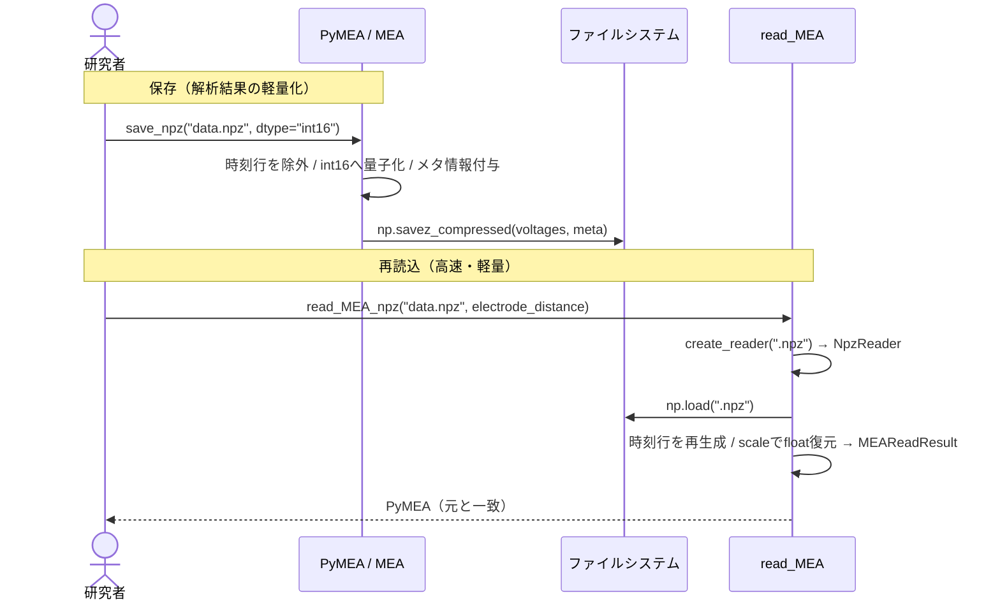

# PRD: MEA計測データの容量・メモリ削減（dtype最適化 / .npz保存対応）

| 項目 | 内容 |
|---|---|
| ステータス | Done |
| 作成日 | 2026-06-13 |
| 対象 | pyMEA（MEA計測データ解析ライブラリ） |
| 関連 | 既存 `read_bio` / `hed2array` / `read_MEA` / `MEA`（`@dataclass(frozen=True)`） |

---

## 1. 背景・課題

MEA（多点電極アレイ）で取得する細胞外電位は、64ch × 高サンプリングレート（最大100kHz）× 長時間で**データ容量が非常に大きい**。研究者からは「保存ファイル・メモリ使用量を軽くしたい」というニーズがある。

現状、`read_bio` は生データ（`.bio`）を **int16（2バイト/サンプル）** で読み込んだ直後、スケーリング係数を1回掛けて **float64（8バイト/サンプル）** に変換して保持している（`read_bio.py:48-59`）。

```python
data = (
    np.fromfile(bio_path.path, dtype="<h", ...)   # int16 (16bit)
    * (volt_range / (2**16 - 2)) * 4              # ← この時点で float64 化
)
```

**問題は、float64 が「精度のため」ではなく「演算の都合」で付いている点にある。** 元データの情報量は 16bit しかないのに、それを 64bit の箱に入れているため、メモリ・保存容量が**本質的に4倍に膨らんでいる**。

| 観点 | 現状 | 課題 |
|---|---|---|
| 保存形式 | 提供なし（解析の都度 `.bio` から再読込） | 中間結果を軽量保存して再利用したい |
| メモリ dtype | float64（8バイト） | 16bit情報を4倍の容量で保持 |
| 時刻行 | `array[0]` を実体で保持 | `SAMPLING_RATE` と `start` から再生成可能（冗長） |

## 2. 技術的根拠（検証済み）

本 PRD の前提となる「float64 は不要」という主張を、実データのスケーリングを再現して数値検証した。

### 2.1 元データは 16bit 整数である

`.bio` の各サンプルは `dtype="<h"`（int16, -32768〜32767）。これに定数係数を1回掛けているだけなので、**取りうる値は高々 65536 段階で、情報量は 16bit のまま**増えていない。

### 2.2 float32 で実質無損失

int16 全域（-32768〜32767）にスケーリング係数を掛けた float64 値を float32 にキャストして誤差を測定した。

| 指標 | 値 | 意味 |
|---|---|---|
| 1 LSB（ADC分解能） | `6.10e-03 μV` | これ以下の差は測定器が元々区別できていない |
| float32化の最大誤差 | `7.63e-06 μV` | — |
| 誤差 ÷ LSB | **0.00125** | ADC分解能の約 1/800。ノイズ未満の桁のみ変化 |
| int16 へ戻したときの一致 | **完全一致（True）** | `round(data/lsb)` で元の int16 を無損失復元 |

→ **float32 は実質無損失、int16 + 係数は完全無損失。** float64 が必須なのは `sosfiltfilt` 等の**計算途中**のみで、保存・保持には不要。

### 2.3 計算速度への影響（限定的）

64ch × 10kHz × 10秒の合成データで float64 / float32 を比較計測：

| 処理 | 速度比(f64→f32) | 備考 |
|---|---|---|
| スケーリング（要素ごと） | **1.95x** | メモリ帯域律速 → ほぼ理論通り2倍 |
| CMR（中央値減算） | 1.07x | median はソート主体で帯域律速でない |
| highpass 1Hz（filtfilt） | 0.98x | ⚠️ SciPyが内部で**float64へ昇格**し出力も float64 |
| notch 50Hz（filtfilt） | 0.98x | ⚠️ 同上 |
| peak検出相当（diff） | 1.06x | ほぼ誤差 |

→ **float32 の速度メリットは軽い要素演算に限定**。解析のボトルネックである IIR フィルタは SciPy が float64 に昇格するため恩恵ゼロ。**float32 の本命は「メモリ・容量半減」**であり、本 PRD の主目的はそこに置く。

### 2.4 IIRフィルタは float64 を必須としない（検証済み・最重要）

「float32 で保持するとフィルタが壊れるのではないか」という懸念を実データ相当（ドリフト + スパイク + 白色ノイズ + 50Hz電源、ADC量子化再現）で検証した。最悪条件の **1Hzハイパス**（正規化カットオフが極小で数値的に不安定）を含む全手法で、float32保持 → フィルタ → float32復元 の最終誤差を float64 経路と比較した。

| フィルタ | 最大誤差 | 誤差/スパイク振幅 | 誤差/1 LSB |
|---|---|---|---|
| highpass(1Hz) | `1.89e-07 μV` | `8.9e-08` | **0.000** |
| bandpass(1-1000) | `4.49e-08 μV` | `8.6e-08` | **0.000** |
| bandpass(100-3000) | `1.15e-07 μV` | `9.6e-08` | **0.000** |
| notch(50Hz) | `2.19e-07 μV` | `8.7e-08` | **0.000** |

**結論：float64 保持は必須ではない。** SciPy の `sosfiltfilt`/`filtfilt` は入力 dtype に関わらず**フィルタ演算を常に内部 float64 で実行する**（出力 dtype は float64）。したがってユーザー側がデータを **float32 で保持していても、フィルタ精度は float64 保持時と同一**で、最終誤差は ADC 分解能(1 LSB)の 1/1000 未満に収まる。float64 保持は単なる慣習であり、メモリを倍消費する正当な理由がない。

→ この知見により、**「読み込み時 float32 保持」を最優先（Phase 1）とする**（メモリ半減を即座に享受、フィルタ精度の犠牲なし）。

**実装上の注意**: フィルタ出力は SciPy が float64 で返すため、`MEA._rebuild_voltages`（フィルタ後の再構築）で float32 へ戻さないと、フィルタ通過のたびに float64 へ膨らむ。保持 dtype を一貫させるキャストを入れる。

## 3. ゴール / 非ゴール

### ゴール
- **MEA データを読み込み時から float32 で保持し、メモリ使用量を半減する（最優先）。** IIRフィルタは内部 float64 で計算されるため精度は犠牲にならない（2.4 で検証済み）。
- MEA データを軽量に**保存・再読込**できる手段（`.npz`）を提供する。
- 保存時の dtype を **float32（実質無損失）/ int16（完全無損失）** から選べるようにし、容量を 1/2〜1/4 に削減する。
- 既存の公開 API・イミュータブル設計・依存方向ルールを壊さない。

### 非ゴール
- 既存の `.hed`/`.bio` 読み込み経路の置き換えではない（**併存**。`.npz` は中間保存・再利用用途）。
- 可逆性を犠牲にする非可逆圧縮（間引き等）は対象外（`down_sampling` が別途存在）。
- リアルタイム・ストリーミング保存は対象外（バッチのみ）。

## 4. 実証結果（容量・性能の根拠）

### 4.1 dtype別の容量（64ch + 時刻行, 10kHz, 1秒あたり）

| 保持形式 | バイト/サンプル | 容量/秒 | 対 float64 |
|---|---|---|---|
| float64（現状） | 8 | 5.12 MB | 1.00x |
| float32 | 4 | 2.56 MB | **0.50x** |
| int16（生ADC値＋係数） | 2 | 1.28 MB | **0.25x** |

### 4.2 `.npz` 圧縮の効き方

- `np.savez`（無圧縮ZIP）はほぼ軽くならない。**`np.savez_compressed`（DEFLATE）を用いる**。
- float64 のまま圧縮しても、仮数部下位ビットがノイズ的で zlib と相性が悪く 3〜5割減にとどまる。**効くのは dtype 縮小**。
- 時刻行 `array[0]` は `SAMPLING_RATE` と `start` から再生成可能なので**保存しない**（65行→64行、約1.5%節約 + 復元時に `np.arange/sampling_rate + start` で再構築）。

## 5. 提案するソリューション

### 5.1 保存 API（application/presentation層）

`PyMEA` または `MEA` に保存メソッドを追加（イミュータブル、副作用なし）。

| API | 内容 |
|---|---|
| `save_npz(path, dtype="float32")` | 電位データ + メタ情報（`SAMPLING_RATE`, `GAIN`, `start`, `end`, `dtype`, 復元用 `scale`）を `np.savez_compressed` で保存。`dtype="int16"` 指定で完全無損失保存 |

**int16 保存時**は `round(voltage / lsb)` で生ADC整数に戻し、復元用の `scale`（= `lsb` 相当の係数）をメタ情報に同梱する。

### 5.2 読み込み API（Reader ファクトリ + 正規化DTO / 入口分離）

形式（`.hed`/`.bio` vs `.npz`）ごとにメタ情報の出所が異なる（下表）ため、infrastructure 層に **Reader 抽象 + ファクトリ + 正規化DTO** を設けて読込経路を出し分ける。新形式（将来の ASCII 等、Issue #23）追加時に既存コードを触らずに済む（開放閉鎖原則）。

| 形式 | array | SAMPLING_RATE / GAIN | start / end |
|---|---|---|---|
| `.hed`/`.bio` | `hed2array` | `decode_hed` | 引数 |
| `.npz` | ファイル内 | ファイル内 | ファイル内 |

**infrastructure 層（依存方向: infra → domain を遵守）**

```python
@dataclass(frozen=True)
class MEAReadResult:                 # 正規化DTO（イミュータブル）
    array: NDArray[float64]
    sampling_rate: int
    gain: int
    start: float
    end: float

class MEAReader(Protocol):
    def read(self) -> MEAReadResult: ...

class HedBioReader(MEAReader): ...   # 既存 hed2array/decode_hed をラップ
class NpzReader(MEAReader): ...      # np.load + メタ復元 + 時刻行再生成

def create_reader(path: str, ...) -> MEAReader:   # 拡張子で分岐
    match Path(path).suffix:
        case ".hed": return HedBioReader(path, start, end, dtype)
        case ".npz": return NpzReader(path)
        case other:  raise ValueError(f"未対応の拡張子: {other}")
```

**application 層（入口分離・案B）**: 公開 API 契約（`test_public_api.py`）を壊さないため `read_MEA` のシグネチャは変えず、`.npz` 用の入口を別途追加する。両入口とも内部では `create_reader().read()` を共用する。

| API | 用途 | 備考 |
|---|---|---|
| `read_MEA(hed_path, start, end, electrode_distance, ...)` | `.hed`/`.bio` 読込（既存） | シグネチャ不変。内部で `HedBioReader` 経由に置き換え |
| `read_MEA_npz(path, electrode_distance)` | `.npz` 読込（新規） | `start`/`end`/`sampling_rate`/`gain` はファイルから復元。`.hed` 専用引数（`start`/`end`/`filter_type` 等）を持たないため引数の意味が形式依存にならない |

> 入口を分離する理由: `start`/`end`/`filter_type` は `.hed` 読込専用の引数で、既に処理済みの `.npz` には不要。単一入口に押し込むと引数の有効/無効が形式依存になり混乱を招くうえ、公開API契約の変更も避けられる。Reader ファクトリ（infra層）は両入口で共用するため重複は生じない。

### 5.3 読み込み時 float32 保持（最優先）

`read_bio` / `read_MEA` に `dtype` 引数を追加し、**読み込み時点で float32 として保持**する（メモリ半減）。2.4 の検証により IIRフィルタはこれで精度を損なわないため、**本機能を Phase 1（最優先）とする**。

- `read_bio`（`read_bio.py:48-59`）のスケーリング結果を `dtype` に応じて `astype(float32)` する。`dtype` は `read_MEA` → `create_reader` → `HedBioReader` 経由で渡す。
- `MEA._rebuild_voltages`（フィルタ後の再構築）で保持 dtype に合わせて `astype` し、SciPy が返す float64 で膨らまないようにする。
- **デフォルト dtype の方針**: float32 をデフォルトにするとメモリ削減が即座に全利用者に効くが、`mea.array.dtype == float64` を暗黙前提にする既存コードへ影響しうる（9章のリスク参照）。本 PRD では **デフォルト float32・`dtype="float64"` で opt-out** を推奨方針とするが、後方互換重視なら「デフォルト float64・float32 opt-in」も選べる（実装前に確定する）。

### 5.4 処理フロー



## 6. 要件

### 機能要件
- FR-1: `.npz` 保存・読込でデータが復元できる（float32: 誤差 < 1 LSB、int16: 完全一致）。
- FR-2: 保存は `np.savez_compressed` を用い、メタ情報（`SAMPLING_RATE`, `GAIN`, `start`, `end`, `dtype`, `scale`）を同梱する。
- FR-3: 時刻行は保存せず、読込時に `SAMPLING_RATE`/`start` から再生成する。
- FR-4: 既存の `.hed`/`.bio` 読込経路を変更しない（併存）。`.npz` は専用入口 `read_MEA_npz` で読み込む（入口分離）。
- FR-5: 既存の公開 API（`__all__`）のシグネチャ・入出力を変えない（`test_public_api.py` で担保）。新規 `read_MEA_npz` は `__all__` に追加。
- FR-6: 読込経路は infrastructure 層の Reader ファクトリ（`create_reader`）で拡張子ディスパッチし、各 Reader は正規化DTO `MEAReadResult` を返す。新形式追加時に既存 Reader / 入口を変更しない。

### 非機能要件
- NFR-1: 依存方向ルール（domain → 外部I/O・matplotlib非依存。ファイルI/Oは infrastructure 層）を守る。
- NFR-2: イミュータブル（保存は副作用なし、読込は新インスタンス返却）。
- NFR-3: 追加依存なし（NumPy 標準の `savez_compressed` / `load` を使用）。
- NFR-4: 64ch・数十秒データで実用的な保存・読込速度。

## 7. テスト方針

- 既存のフィクスチャ方式（`test/resources/fixtures/*.npz`、原本データ非コミット）を踏襲。
- ラウンドトリップ test: `save_npz → read_MEA` で
  - int16: 元データと**完全一致**（`np.array_equal`）。
  - float32: 誤差が **1 LSB 未満**（許容誤差ベース比較）。
- 時刻行再生成の検証（`SAMPLING_RATE`/`start` から元の時刻配列に一致）。
- メタ情報（`SAMPLING_RATE`, `GAIN`, `start`, `end`）の保持を検証。
- 容量検証: `savez_compressed` 後のファイルサイズが float64 比で float32≈1/2・int16≈1/4 になること。

## 8. 段階リリース計画

| フェーズ | 内容 |
|---|---|
| **Phase 1（最優先）** | `read_bio`/`read_MEA` の `dtype` 引数（**読み込み時 float32 保持・メモリ半減**）+ `MEA._rebuild_voltages` の dtype 一貫キャスト + 精度テスト（フィルタ後も誤差 < 1 LSB） |
| Phase 2 | Reader ファクトリ（`create_reader` + `MEAReadResult` + `HedBioReader`/`NpzReader`）+ `save_npz`（float32 / int16）+ `read_MEA_npz` 入口 + ラウンドトリップテスト |
| Phase 3 | 時刻行の非保存・再生成最適化 + 容量検証テスト |
| Phase 4 | ドキュメント（README_ja に保存・再読込フロー、dtype選択の指針・誤差根拠）更新 |

## 9. リスク・留保点

- **int16 の可逆性は係数（scale）の同梱が前提**。メタ情報が欠けると復元できないため、保存フォーマットにバージョン/メタを必ず含める。
- **float32 保持はフィルタ精度を損なわない**（2.4 で検証済み。SciPy が内部 float64 で計算するため、最悪条件の1Hzハイパスでも誤差 < 1 LSB の 1/1000）。ただしフィルタ出力は float64 で返るため、`_rebuild_voltages` で float32 へ戻すキャストを必ず入れる（漏れると保持 dtype が float64 に膨らむ）。
- **「保持メモリは半減」だが「処理中の瞬間ピークメモリ(peak RSS)は必ずしも半減しない」**。float32 化で削減されるのは *ロード済み配列を保持している間* のメモリ（MEA データの支配項なので常駐メモリは実質ほぼ半分）。一方、以下の場面では float64 の一時バッファが乗るためピークは半分にならない:
  - **読み込み変換時**: `np.fromfile`(int16) のスケーリングで float64 中間配列が生じうる。回避するにはスケーリングを float32 で直接行う（`int16 → astype(float32) → ×scale` の順で float64 を経由しない）。
  - **フィルタ実行時**: SciPy が内部で float64 へ昇格するため、`sosfiltfilt`/`filtfilt` 実行の瞬間にデータ相当の float64 一時バッファが確保される（保持結果は float32 に戻す）。
  - 含意: 「複数ファイルを常駐」「長時間データを開きっぱなし」のような *常駐メモリ律速* には半減が効くが、「最小RAMで巨大ファイルを1回フィルタ」のような *ピーク律速* では半減を体感しきれない場合がある。
- **`down_sampling` の min/max 出力など、dtype が伝播する箇所**の挙動確認（int16 量子化と組み合わせた際の精度）。
- 既存利用者が `mea.array.dtype == float64` を暗黙に前提しているコードへの影響。デフォルトは float64 を維持し後方互換を守る。

## 10. 成功指標

- `.npz` 保存で容量が float64 比 **float32≈1/2・int16≈1/4** に削減（実証済みの理論値）。
- int16 ラウンドトリップが**完全一致**、float32 が**誤差 1 LSB 未満（ADC分解能の約1/800）**であることをテストで担保。
- 利用者が解析中間結果を軽量保存し、`.bio` 再読込より高速に再利用できる。
- 既存 `.hed`/`.bio` 経路・公開 API に一切の非互換を生じない。
