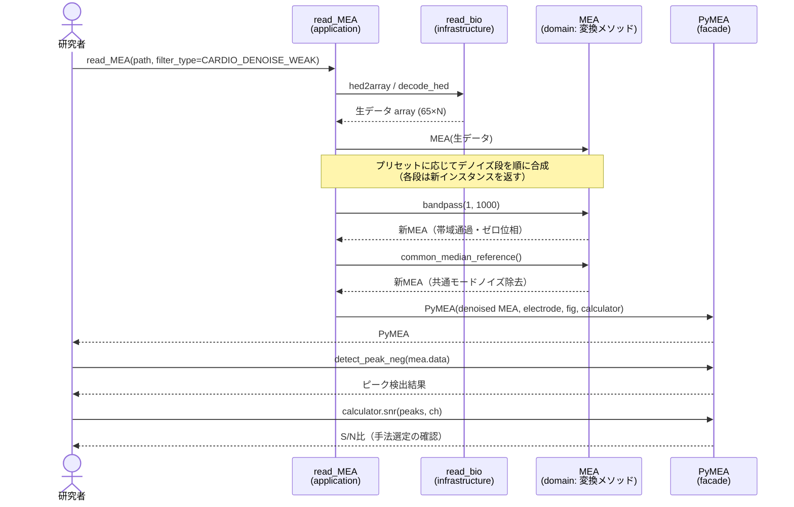
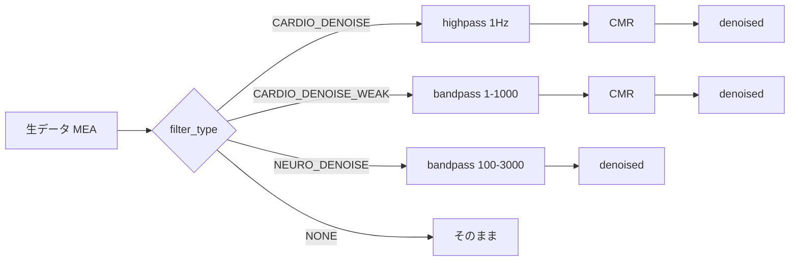

# PRD: MEA計測データのノイズ除去 / SN比改善機能

| 項目 | 内容 |
|---|---|
| ステータス | Draft |
| 作成日 | 2026-06-13 |
| 対象 | pyMEA（MEA計測データ解析ライブラリ） |
| 関連 | 既存 `FilterType.FILTER_MEA` / `FilterType.CARDIO_AVE_WAVE` / `MEA.iirnotch_filter` |

---

## 1. 背景・課題

MEA（多点電極アレイ）で取得する心筋・神経の細胞外電位は、細胞の信号が弱いとき S/N 比が低く、ピーク検出・ISI・FPD・伝導速度の算出精度が落ちる。研究者からは「弱い信号のノイズを除去して S/N 比を上げたい」というニーズがある。

現状の手法は目的が限定的で、**全時系列を保ったまま弱信号の S/N を底上げする汎用デノイザが存在しない**。

| 既存手法 | 実体 | 限界 |
|---|---|---|
| `FilterType.FILTER_MEA` | 電源周波数に同期した周期平均の減算 | 電源ハム専用。広帯域ノイズ・ドリフトに無効 |
| `FilterType.CARDIO_AVE_WAVE` | 拍動トリガの加算平均（スパイクトリガ平均） | 時系列を1拍に潰す。ISI・拍動間変動・不整脈が消える |
| `MEA.iirnotch_filter` | 50Hz ノッチ | 電源基本波のみ |

加えて、64ch という**空間冗長性**を全く活用できていない（全処理がチャンネル独立）。

## 2. フィルター手法の詳細

本 PRD で扱う各手法の原理・対象ノイズ・長所・注意点を先に整理する。ノイズ源（ドリフト／電源／帯域外広帯域／帯域内白色／共通モード）によって効く手法が異なるため、単一の万能手法は存在しない点に留意する。

### 2.1 新規手法

#### バンドパス / ハイパス（ゼロ位相 Butterworth）
- **原理**: Butterworth フィルタを `scipy.signal.sosfiltfilt` で順方向・逆方向に2回かけ（zero-phase）、指定した周波数帯のみ通す。ハイパスは下限のみ指定、バンドパスは上下限を指定。
- **対象ノイズ**: ベースラインドリフト（低周波）、信号帯域外の広帯域ノイズ、電源（帯域設定で除外可）。
- **長所**: ゼロ位相なので**ピークタイミングがずれない**（ISI・伝導速度を壊さない）。軽量・決定的。追加依存なし。
- **注意**: 帯域選定が肝。心筋で狭帯域（1-300Hz）は鋭い脱分極スパイクを潰すため不可。心筋は 1-1000Hz 程度、神経は 100-3000Hz 程度が目安。
- **パラメータ**: 下限/上限周波数、次数 `order`。

#### 共通中央値リファレンス（CMR: Common Median Reference）
- **原理**: 各時刻で全 64 電極の**中央値**を求め、各電極から減算。全電極に共通して乗るノイズ（共通モード）を除去する。平均（CAR）でなく中央値を使うことで、同期した信号成分を引きすぎない。
- **対象ノイズ**: 電源ハム、参照電極のドリフト、機械振動など**電極間で相関する**ノイズ。
- **長所**: 64ch の空間冗長性を活用。安価で、個々のスパイク形状を変えない（無歪み）。
- **注意**: 全電極が強く同期する状況（心筋の同期拍動）では信号も一部引きうるが、中央値なら影響は限定的。電極間で無相関な熱雑音には無効。神経データでは共通モード成分が少なく効果が薄い場合がある。
- **パラメータ**: なし。

#### ウェーブレット縮退（Wavelet Denoising）
- **原理**: 離散ウェーブレット変換（DWT）で信号を多重解像度分解し、ノイズに相当する小さな係数をソフト閾値で縮退してから再構成する。閾値はノイズ標準偏差から自動算出（universal threshold = σ√(2 ln N)）。
- **対象ノイズ**: 信号帯域内に重なる広帯域（白色）ノイズ。
- **長所**: 線形フィルタと違い、鋭いトランジェント（スパイク）形状を保ったまま帯域内ノイズを除去できる。単 ch では最も高い S/N 改善（強信号心筋で実証）。
- **注意**: **微弱信号では弱いスパイクごと削るリスク**（取りこぼし）。母関数・分解レベル・閾値の選定が必要。
- **パラメータ**: ウェーブレット母関数（既定 `db4`）、分解レベル。
- **依存**: PyWavelets の追加が必要。

### 2.2 既存手法（比較・併存）

#### FILTER_MEA（電源同期減算）
- **原理**: 電源周期（50Hz = 200 フレーム @10kHz）に同期して連続する周期波形を平均し、ノイズ波形を推定して減算。
- **対象**: 電源ハムの基本波。
- **限界**: 広帯域ノイズ・ドリフトには無効。高調波（100/150Hz）が残る。

#### CARDIO_AVE_WAVE（拍動トリガ平均）
- **原理**: 拍動でトリガした窓を全拍で加算平均（スパイクトリガ平均）。
- **効果**: 1拍ぶんの波形 S/N を √N（N=拍数）倍に改善。
- **限界**: 時系列を 1 拍に潰すため、ISI・拍動間変動・不整脈が失われる。**デノイズ（時系列保持）とは目的が異なり、置き換えではなく併存**。

#### iirnotch
- **原理**: 50Hz ノッチフィルタ（`scipy.signal.iirnotch` + `filtfilt`）。
- **限界**: 電源基本波のみ。

## 3. ゴール / 非ゴール

### ゴール
- 全時系列・ピークタイミングを保持したまま S/N 比を改善するデノイズ手法群を提供する。
- 心筋・神経それぞれに適したプリセットを提供し、利用者が最小の知識で適用できるようにする。
- 既存の公開 API・イミュータブル設計・依存方向ルールを壊さない。
- 各手法の効果を利用者が自分のデータで測定できる S/N 比指標を提供する。

### 非ゴール
- スパイクソーティング・分類は対象外。
- リアルタイム（オンライン）処理は対象外（バッチ解析のみ）。
- `CARDIO_AVE_WAVE`（時系列を潰す平均波形）の置き換えではない。用途が異なるため併存させる。

## 4. 実証結果（実データでの根拠）

心筋サンプルデータ（SR 10000Hz、スパイク強）・神経サンプルデータ（SR 10000Hz、RMS 3.5μV の弱信号）で各手法を試作・比較。評価は「高閾値で検出した確実な実スパイクのみ」を対象に、S/N 比改善・ノイズ低減・振幅保持で測定した。

### 心筋サンプルデータ
| 手法 | S/N 改善 | ノイズRMS | 振幅保持 | 検出/タイミング |
|---|---|---|---|---|
| **wavelet** | 1.25x | 78% | 94% | 80検出 100% 0msズレ |
| **highpass(1Hz)+CMR** | 1.23x | 88% | 102% | 80検出 100% 0msズレ |
| CMR（中央値） | 1.20x | 88% | 102% | — |
| bandpass 1-1000 | 1.14x | 78% | 104% | 0.1msズレ |
| bandpass 1-300 | 0.57x | 78% | 49% | 鋭スパイク半減（不可） |

### 神経サンプルデータ（弱信号）
| 手法 | S/N 改善 | ノイズRMS | 振幅保持 |
|---|---|---|---|
| bandpass 300-3000 + wavelet | 1.35x | 30% | 50%（積極的） |
| **bandpass 100-3000** | 1.16x | 78% | 92%（バランス） |
| bandpass 300-3000 | 1.05x | 66% | 73% |
| wavelet 単体 | 1.01x | 57% | 59% |
| CMR | 1.02x | 101% | 100%（神経では効果薄） |

### 知見
- **心筋（強信号）**: ドリフトは highpass(1Hz) で十分。狭帯域 bandpass(1-300) は鋭い脱分極スパイクを半減させるため禁物。CMR が 64ch を活かして振幅無歪みで S/N を上げる。
- **神経**: スパイク帯は 300-3000Hz だが、下限を 100Hz にすると振幅をより保てる。極弱信号は wavelet 併用で大幅にノイズ低減。CMR は効果薄。
- 心筋は検出 80件・真検出率 100%・タイミングズレ 0ms を確認済み。神経は正解ラベルが無く相対閾値検出が交絡するため、検出レベルの最終評価は利用者データでの目視調整が必要。

### 4.1 微弱心筋への対応（シミュレーション検証）

実験条件によっては心筋信号も非常に微弱になる。心筋サンプルデータは強信号（S/N≈49）のため、強信号に「各電極独立の広帯域ノイズ + 全電極共通の50Hz電源ノイズ」を付加して S/N を落とし、正解スパイク位置（強信号で確定）に対する回復を測定した。

**強い劣化（S/N≈6.6、明確に微弱）**
| 手法 | 真検出率 | 誤検出 | S/N |
|---|---|---|---|
| raw（劣化） | 95% | 23% | 6.6 |
| **bandpass(1-1000) + CMR** | 100% | 8% | 11.5 |
| bandpass(1-1000) + wavelet | 100% | 7% | 9.0 |
| bandpass(1-1000) | 99% | 8% | 8.8 |
| highpass + CMR | 96% | 21% | 6.6 |
| wavelet | 84% | 0% | 6.8 |

**結論: 微弱心筋でも対応可能。** ただし最適手法は S/N で変わる:
- **微弱時は bandpass が必須**。支配ノイズが帯域外の広帯域ノイズになるため、bandpass(1-1000、鋭スパイクは保持) + CMR で真検出率100%・誤検出23%→8%・S/N ほぼ倍化。
- **highpass+CMR（強信号で最良）は微弱時は不足**。共通モードの電源は消せても広帯域ノイズが残り S/N が上がらない。
- **微弱心筋に wavelet は危険**。弱いスパイクごと削り、真検出率が 84% に低下（取りこぼし）。
- 留保: これは強信号へのノイズ付加シミュレーションであり、実際の微弱記録（細胞信号自体が小さい）での確認を推奨。

## 5. 提案するソリューション

`MEA` に合成可能な変換メソッドを追加する（全て新インスタンスを返すイミュータブル設計、ゼロ位相でタイミング保持）。各手法の原理は「2. フィルター手法の詳細」を参照。

### 5.1 追加メソッド（domain層）
| メソッド | 実装 | 依存追加 | 主用途 |
|---|---|---|---|
| `MEA.highpass(cutoff=1, order=4)` | `scipy.signal.butter` + `sosfiltfilt` | なし | ドリフト除去（心筋） |
| `MEA.bandpass(low, high, order=4)` | 同上（帯域通過、ゼロ位相） | なし | スパイク帯抽出（神経） |
| `MEA.common_median_reference()` | 全電極の各時刻中央値を減算 | なし | 共通モードノイズ除去（心筋） |
| `MEA.wavelet_denoise(wavelet="db4", level=None)` | DWT + ソフト閾値（universal threshold） | **PyWavelets** | 単ch広帯域デノイズ |

### 5.2 プリセット（application層 / `FilterType` 拡張）

S/N 比に応じて最適手法が変わるため、プリセットを出し分ける。

| プリセット | 内容 | 対象 |
|---|---|---|
| `FilterType.CARDIO_DENOISE` | highpass(1Hz) → common_median_reference | 心筋（強〜中信号、無歪み優先） |
| `FilterType.CARDIO_DENOISE_WEAK` | bandpass(1, 1000) → common_median_reference | 微弱心筋（広帯域ノイズ除去優先） |
| `FilterType.NEURO_DENOISE` | bandpass(100, 3000) | 神経 |

`read_MEA(..., filter_type=FilterType.CARDIO_DENOISE)` の1引数で適用できる。

**注意**: 微弱心筋に wavelet は弱スパイクを削り検出率を下げるため、プリセットには含めない。利用者が自分のデータで `Calculator.snr` を見ながら手法を選べるようドキュメントで誘導する。

### 5.3 S/N 比計測ユーティリティ
- `Calculator.snr(peak_index, ch)` 等で `スパイク振幅 / 静穏区間ノイズRMS` を返し、利用者が自分のデータで手法を客観選定できるようにする。

### 5.4 処理フロー（シーケンス図）

プリセット指定での読み込みからデノイズ・解析までの流れ。各デノイズ段は新しい `MEA` を返す（イミュータブル）。

**プリセットごとのデノイズ段**

なお、プリセットを使わず `MEA` の変換メソッド（`highpass` / `bandpass` / `common_median_reference` / `wavelet_denoise`）を直接合成して、利用者が独自パイプラインを組むこともできる。

## 6. 要件

### 機能要件
- FR-1: 各デノイズメソッドは全時系列（時刻行含む shape (65, N)）を保持し、新しい `MEA` を返す。
- FR-2: フィルタはゼロ位相（`sosfiltfilt`）で、ピークタイミングを変えない。
- FR-3: `FilterType` のプリセットは `read_MEA` から選択できる。
- FR-4: S/N 比指標を提供する。
- FR-5: 既存の公開 API（`__all__`）のシグネチャ・入出力を変えない（`test_public_api.py` で担保）。

### 非機能要件
- NFR-1: 依存方向ルール（domain → 外部I/O・matplotlib非依存）を守る。
- NFR-2: イミュータブル（`@dataclass(frozen=True)`、新インスタンス返却）。
- NFR-3: PyWavelets 追加は `requirements.in` / `requirements.txt` に反映。CI で再現可能。
- NFR-4: 64ch・数十秒データで実用的な処理速度。

## 7. テスト方針

- 既存のフィクスチャ方式（`test/resources/fixtures/*.npz`、原本データ非コミット）を踏襲。
- 各メソッドのユニットテスト: shape 保持・イミュータブル性・ゼロ位相（タイミング不変）・ノイズ低減の検証。
- プリセットの統合テスト: `read_MEA(filter_type=...)` 経由で S/N 改善を確認。
- 浮動小数点・プラットフォーム差は許容誤差ベースで比較（既存 CI 方針に準拠）。

## 8. 段階リリース計画

| フェーズ | 内容 |
|---|---|
| Phase 1 | `highpass` / `bandpass` / `common_median_reference`（依存追加なし）+ テスト |
| Phase 2 | `wavelet_denoise`（PyWavelets 追加）+ テスト |
| Phase 3 | `FilterType.CARDIO_DENOISE` / `CARDIO_DENOISE_WEAK` / `NEURO_DENOISE` プリセット + S/N 指標 |
| Phase 4 | ドキュメント（README_ja の使い方、推奨帯域・パラメータ表）更新 |

## 9. リスク・留保点

- **最適手法は S/N 比で変わる**。強信号の最良手法（心筋 highpass+CMR / wavelet）が微弱時には不足または逆効果（wavelet は弱スパイクを削る）。S/N に応じたプリセット出し分けと、`Calculator.snr` による利用者側の手法選定が前提。
- **神経の最適パラメータ**は正解ラベルが無く一意に決まらない。プリセットは出発点とし、帯域・閾値は利用者データでの目視調整を推奨（ドキュメントで明記）。
- **CMR の適用注意**: 心筋は全面同期拍動のため平均(CAR)だと信号を引きうる。中央値(CMR)を採用し、神経では効果が薄い旨を明記。
- **PyWavelets 追加**による依存増（軽量だが要レビュー）。
- 既存手法との混同を避けるため、`CARDIO_AVE_WAVE`（時系列を潰す）と新デノイズ（時系列保持）の用途差をドキュメントで明確化する。

## 10. 成功指標

- 弱信号データで S/N 比が有意に改善（強信号: 心筋 約1.2x・神経 約1.15x、微弱心筋 S/N≈6.6: 約1.7x を実証済み）。
- 微弱条件でも真検出率が劣化しない（微弱心筋で 95%→100%、誤検出 23%→8% を確認済み）。
- ピーク検出数・タイミングが劣化しない（強信号心筋で 100%/0ms を確認済み）。
- 利用者が1引数（プリセット）で細胞種・信号強度に応じたデノイズを適用できる。
