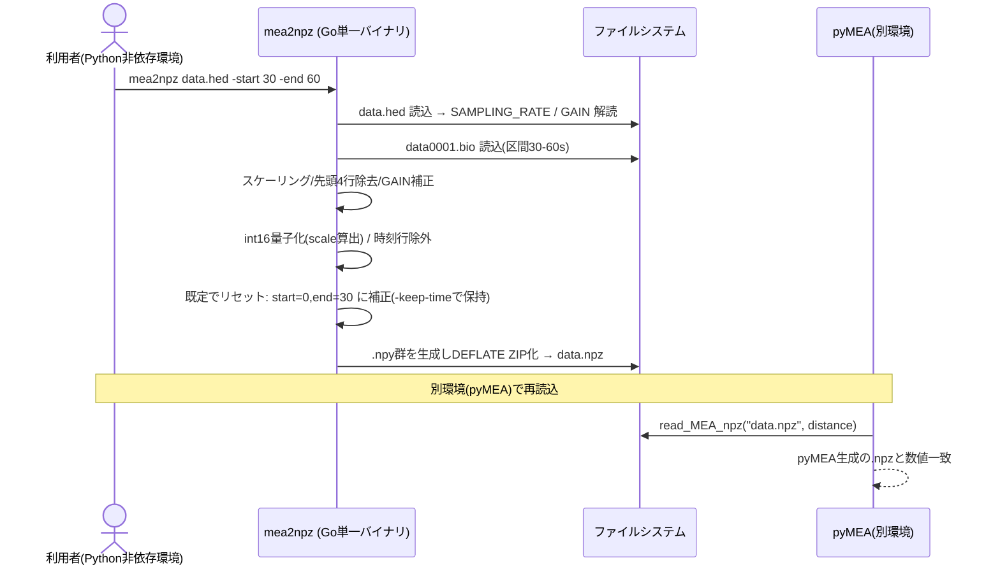

# PRD: .hed/.bio → .npz 変換 CLI ツール（Go・単一バイナリ）

| 項目 | 内容 |
|---|---|
| ステータス | Draft |
| 作成日 | 2026-06-17 |
| 対象 | mea2npz（pyMEA 付属の変換 CLI ツール） |
| 関連 | 既存 `data-compression.md`（.npz フォーマット） / `infrastructure/read_bio.py` / `infrastructure/npz_io.py` / `infrastructure/reader.py`（`NpzReader`） |
| 配置 | 本リポジトリ `tools/mea2npz/`（独立した Go モジュール） |

---

## 1. 背景・課題

`.hed`/`.bio` 形式の MEA 生計測データは容量が大きく、解析の都度 `.bio` から再読込している。`data-compression.md` で導入した `.npz`（dtype 縮小 + DEFLATE 圧縮、容量 1/2〜1/4）への変換は、現状 **Python（pyMEA）環境がないと実行できない**。

しかし計測現場や共同研究者の端末では、

- **Python / pyMEA がインストールされていない**
- pyMEA は **devcontainer 内にしか存在しない**ケースがある
- Windows / macOS が混在し、環境構築のハードルが高い

という制約があり、「生データを受け取った人がその場で軽量な `.npz` に変換する」ことができない。

**課題: Python 非依存で、Windows / macOS / Linux のいずれでも追加インストールなしに動く、`.hed` → `.npz` 変換手段が必要。**

## 2. 技術的根拠（フォーマット仕様）

> 本ツールの肝は「Go が生成した `.npz` を pyMEA の `read_MEA_npz`（`NpzReader`）がそのまま読めること」。以下はその実現可能性の根拠。**出力の数値的一致は本ツール完成後にテストで検証する（7章）。**

### 2.1 `.npz` は ZIP + `.npy` の組み合わせ

`np.savez_compressed` が生成する `.npz` は、実体が **DEFLATE 圧縮 ZIP アーカイブ**で、各メンバが `<キー名>.npy` ファイル。`.npy` は「マジック `\x93NUMPY` + バージョン + ヘッダ dict（`descr`/`fortran_order`/`shape`）+ 生バイト列」という公開仕様。Go 標準ライブラリ（`archive/zip` + `compress/flate`）のみで生成でき、**NumPy ランタイムは不要**。

### 2.2 変換処理は単純な配列演算

既存 Python ロジック（`read_bio.py` / `npz_io.py`）を移植する。難解なアルゴリズムはなく、すべて整数読み込みと定数係数の積。

| 処理 | 内容 | 移植元 |
|---|---|---|
| `.hed` 解読 | `<h`(int16,LE) で読み、要素 `[16]`→サンプリングレート、`[3]`→GAIN を辞書引き | `decode_hed` |
| `.bio` 読込 | `data_unit_length = 68`（64ch+4）。offset/count 指定で int16 読込 → `×(volt_range/(2^16-2))×4` → reshape → 先頭4行除去 → GAIN 補正 `REFERENCE_GAIN/gain` | `read_bio` |
| 量子化 | int16: `scale = max(|V|)/32767`, `stored = round(V/scale)` / float32: そのまま | `save_mea_npz` |

### 2.3 pyMEA 側が要求する `.npz` の中身（`NpzReader` / `npz_io.py` のキー）

| キー | dtype | 内容 |
|---|---|---|
| `hed_path` | `<U`(UTF-32LE 文字列) | 元 `.hed` パス |
| `voltages` | `<i2`(int16) または `<f4`(float32) | 電位 (64 × N)。**時刻行は含めない** |
| `sampling_rate` | `<i8` | サンプリングレート |
| `gain` | `<i8` | GAIN |
| `start` / `end` | `<f8` | 読込区間（秒） |
| `dtype` | `<U` | `"int16"` / `"float32"` |
| `scale` | `<f8` | int16 復元係数（float32 時は 1.0） |
| `electrode_distance` | `<i8` | 電極間距離 (μm) |

時刻行は保存しない。pyMEA 側が `np.arange(N)/sampling_rate + start` で再生成する。

## 3. ゴール / 非ゴール

### ゴール
- **Python 非依存の単一バイナリ**で `.hed` → `.npz` 変換を提供する（Windows/macOS/Linux）。
- 出力 `.npz` が pyMEA の **`read_MEA_npz` でそのまま読め、pyMEA が生成した `.npz` と数値的に一致**する。
- 読込区間指定（`start`/`end`）、dtype 選択（int16/float32）、電極間距離指定に対応する。
- **時刻オフセットのリセット**（`start=30` で読んでも保存時の開始を 0 s にする）をオプションで提供する。
- **フォルダ一括変換**（ディレクトリ指定で配下の全計測データを変換）を提供する。
- Go ソースは本リポジトリ `tools/mea2npz/` に同居し、**バイナリは GitHub Releases で配布**する。

### 非ゴール
- pyMEA 本体（Python）の変更・置き換えではない（変換ロジックの**移植**であり、`.npz` 仕様の正本は pyMEA 側）。
- `.npz` → `.hed` の逆変換、グラフ描画・解析機能（pyMEA の責務）。
- GUI 提供（CLI のみ。将来検討）。
- pyMEA 側の `.npz` 仕様変更への自動追従（仕様変更時は本ツールも追従改修する。9章）。

## 4. 提案するソリューション

### 4.1 CLI 仕様

```
mea2npz [options] <input>
```

`<input>` は **`.hed` ファイル** または **ディレクトリ**（一括変換モード）。

| オプション | 既定 | 内容 |
|---|---|---|
| `-o <path>` | 単一: 入力と同名 `.npz` / ディレクトリ: 入力配下の `output/` | 出力先。一括変換時は既定で**入力ディレクトリ内に `output/` を作成**して出力（4.3） |
| `-start <sec>` | `0` | 読込開始（秒） |
| `-end <sec>` | ファイル全体 | 読込終了（秒）。省略時は `.bio` の総バイト数から全区間を算出 |
| `-dtype <int16\|float32>` | `int16` | 保存 dtype |
| `-distance <μm>` | `450` | 電極間距離 |
| `-keep-time` | `false` | **時刻オフセットを保持**するopt-out。既定では時刻をリセット（保存メタ `start=0`, `end=end-start`）するが、本フラグ指定時は元の `start`/`end` を保存する（4.2） |
| `-recursive` | `false` | ディレクトリ入力時、サブフォルダも再帰探索 |
| `-jobs <n>` | CPU 数 | 一括変換の並列数 |
| `-h` / `-version` | — | ヘルプ / バージョン |

### 4.2 時刻オフセットのリセット（既定オン）

`start=30, end=60` で読むと、pyMEA 既定では保存メタは `start=30/end=60`（再読込時の時刻行 `30〜60 s`）になる。本ツールは**既定で時刻オフセットをリセット**し、**保存メタを `start=0/end=30`** とする（再読込時の時刻行 `0〜30 s`）。

- 電位データ（`voltages`）自体は変わらず、**メタの `start`/`end` のみ平行移動**する。
- `hed_path` は元のまま保持し、由来は追跡可能（ただし絶対時刻の参照は失われる）。
- **既定オンの理由**: 区間を切り出して保存する用途では「切り出したデータは 0 s 始まり」の方が直感的で、一括変換でも各ファイルが一貫して 0 始まりになる。
- 元の絶対時刻を残したい場合は **`-keep-time`** で opt-out（保存メタに元の `start`/`end` を保持）。

### 4.3 フォルダ一括変換

`<input>` がディレクトリのとき、配下の `*.hed`（対応する `<base>0001.bio` が存在するもの）を列挙し、各々を `.npz` に変換する。

- **出力先**: 既定で**入力ディレクトリ内に `output/` フォルダを作成**（なければ作る）し、そこへ出力する。出力名は入力 `.hed` のベース名 + `.npz`。`-o <dir>` 指定時はそのディレクトリへ出力。
  - 例: `mea2npz ./measurements` → `./measurements/output/<name>.npz` 群を生成。
  - `-recursive` 時はサブフォルダの構造を `output/` 配下に反映（相対パスを維持）。
  - 入力スキャン対象から `output/` 自身は除外する（再変換の混入防止）。
- `-jobs` で並列実行。1 ファイルの失敗が全体を止めないよう、**ファイル単位でエラーを集約**する。**バリデーション失敗（`.bio` 欠如・区間超過・不正値 等）でも `os.Exit` せず、当該ファイルをスキップしてログ（どのファイルがなぜスキップされたか）を出し、残りを継続**する。末尾にサマリ（成功/スキップ/失敗件数）を表示。
- `-start`/`-end`/`-dtype`/`-keep-time` 等は全ファイル共通で適用。

> 実装上の注意: バリデーションは値オブジェクト/ドメインのコンストラクタで `error` を返す形にし（`panic`/`os.Exit` をドメイン・ユースケースで行わない）、`BatchConvertUseCase` がファイルごとに `error` を受けて `ProgressReporter.Failed` に流す。プロセス終了（非0）の判断は最外周（`interface/cli`・`cmd`）でサマリを見て行う。これによりバッチ途中でプロセスが落ちない。

### 4.4 処理フロー



### 4.5 Go アーキテクチャ設計（DDD / クリーンアーキテクチャ）

pyMEA 本体の DDD レイヤー（domain / application / infrastructure / presentation, 依存方向ルール）と**同じ思想**で Go 側も構成する。依存は常に**内向き**（外側が内側に依存し、内側は外側を知らない）。`.hed`/`.bio`/`.npz` のフォーマット詳細はすべて最外周（infrastructure）に隔離し、domain は **NumPy フォーマットもファイル I/O も一切知らない**。

#### レイヤー対応

| クリーンアーキ層 | pyMEA 相当 | Go パッケージ | 責務 |
|---|---|---|---|
| **Domain（最内）** | `domain/model`, `domain/value`, `domain/service` | `internal/domain` | 計測データのエンティティ・値オブジェクト・純粋な数値変換。**リポジトリ風ポート（`MeasurementReader`/`MeasurementWriter`）をドメイン語彙で宣言**。外部 I/O 非依存 |
| **Use Case** | `application`（`read_MEA`/`PyMEA`） | `internal/usecase` | 変換ユースケースの調停。**調停ポート（`FileLister`/`ProgressReporter`）を宣言** |
| **Infrastructure** | `infrastructure`（`read_bio`/`npz_io`/`reader`） | `internal/infrastructure` | domain/usecase のポートを実装。`.hed`/`.bio` 解読、`.npy`/`.npz`(ZIP+DEFLATE) 生成 |
| **Interface/Presentation** | `presentation` | `internal/interface/cli` | CLI 引数解析・一括変換ループ・標準出力 |
| **Composition Root** | — | `cmd/mea2npz` | 依存を注入して起動（最外周で配線） |

#### Domain（純粋・外部非依存）

- **エンティティ**: `Measurement` — 電位データ（64ch × N, float32 保持）、`SamplingRate`、`Gain`、`TimeWindow` を保持するイミュータブルな集約。
- **値オブジェクト**: `SamplingRate` / `Gain`（`.hed` の辞書引き結果を型で表現）、`TimeWindow`（start/end・`Reset()` で 0 始まりへ平行移動）、`Dtype`（`int16`/`float32`）、`ElectrodeDistance`。
- **ドメインサービス**: `Quantizer` — `int16` 量子化（`scale = max(|V|)/32767`、**偶数丸め**）と `float32` パススルーを担う純粋関数。フォーマットに依存しない数値変換のみ。
  > スケーリング後の値→保存表現への変換は「フォーマットの都合」ではなく「データの量子化ポリシー」なので domain に置く。バイト列化（`.npy`/ZIP）は infrastructure の責務として分離する。
- **リポジトリ風ポート（依存性逆転の要）**: 計測データの読込/書込の抽象を**ドメインの語彙だけ**で宣言する（`.hed`/`.npz`・ファイルパスは登場させない）。infrastructure がこれを実装し、domain は実装を一切知らない。

  ```go
  package domain

  // 計測データの取得元（.hed/.bio 等の具体は知らない）
  type MeasurementReader interface {
      Load(window TimeWindow) (Measurement, error)
      Extent() (TimeWindow, error)   // -end 省略時の全区間。「取得可能範囲」をドメイン語彙で表現
  }

  // 計測データの保存先（.npz 等の具体は知らない）
  type MeasurementWriter interface {
      Write(m Measurement) error
  }
  ```

  > パス・dtype・reset-time 等の**フォーマット/ポリシーは構築時に注入**する（例: `npz.NewWriter(path, dtype)` が `domain.MeasurementWriter` を返す）。こうすればポートのシグネチャはドメイン語彙のまま保て、`NpzSink` のようにフォーマット名がインターフェースに漏れない。

#### Use Case（調停ポートを宣言し、フローを調停）

- ドメインのリポジトリポートに依存して変換フローを組む。アプリの段取り（ディレクトリ走査・進捗報告）は**ドメイン概念ではない**ので、ここで宣言する。

  ```go
  package usecase

  // アプリの段取り用ポート（ドメイン概念ではないので usecase 所有）
  type FileLister interface {        // ディレクトリから変換対象を列挙
      List(root string, recursive bool) ([]string, error)
  }
  type ProgressReporter interface {  // 一括変換の進捗/サマリ通知
      Done(path string)                    // 変換成功
      Skipped(path string, reason error)   // バリデーション等でスキップ(止めずにログ)
      Failed(path string, err error)       // 実行時エラーでスキップ
      Summary() (ok, skipped, failed int)  // 集計(終了コード判断に使用)
  }

  // ConvertUseCase はドメインのポートのみに依存（具体フォーマットを知らない）
  type ConvertUseCase struct {
      reader domain.MeasurementReader
      writer domain.MeasurementWriter
  }
  // Execute: reader.Load(window) → (既定でreset-time) → Quantizer → writer.Write
  ```

- `ConvertUseCase`: 単一ファイル変換の調停。`domain.MeasurementReader`/`MeasurementWriter` 越しに呼び、`.hed`/`.npz` 実装を**知らない**。
- `BatchConvertUseCase`: `FileLister` で対象を列挙 → ファイルごとに reader/writer を構築（Composition Root のファクトリ経由）して `ConvertUseCase` を並列実行 → `ProgressReporter` で結果集約。

#### Infrastructure（ポートの実装＝フォーマット詳細を隔離）

- `internal/infrastructure/hedbio`: `domain.MeasurementReader` 実装。`decode_hed` / `read_bio` 相当（int16 読込・スケーリング・先頭4行除去・GAIN 補正）。`Extent()` は `.bio` の総バイト数から全区間を算出。
- `internal/infrastructure/npz`: `domain.MeasurementWriter` 実装。構築時にパス・`Dtype` を受け取り、`Quantizer`（domain）で量子化した結果を `.npy` 化（64バイト境界・dtype 別 `descr`・UTF-32LE 文字列）→ ZIP+DEFLATE。**ここだけが NumPy フォーマットを知る**。
- `internal/infrastructure/fs`: `usecase.FileLister` 実装（ディレクトリ走査、`output/` 除外）。

#### 依存方向（pyMEA のルールと同じ）

```
cmd → interface/cli → usecase → domain
                          │         ↑
        infrastructure ───┴─────────┘
        (domain のリポジトリポート と usecase の調停ポート を実装。
         domain/usecase は infra を知らない＝依存性逆転)
```

- **データ読込/書込の抽象は domain 所有**（リポジトリパターン）。「計測データを読む/書く」はドメインが必要とする能力なので、ドメイン語彙で宣言し infra が満たす。
- **アプリの段取り（列挙/進捗）の抽象は usecase 所有**。ドメイン概念ではないため。
- 置き場所の判定基準: **ポートをドメイン語彙だけで表現できるなら domain、配信・フォーマット・調停の都合が漏れるなら usecase**。

逆方向 import は禁止。domain は他レイヤーへ依存しない。これにより、将来 `.npz` 仕様が変わっても影響は `infrastructure/npz` に閉じ、`.hed` 以外の入力形式追加も `domain.MeasurementReader` 実装を足すだけで済む（pyMEA の Reader ファクトリと同じ開放閉鎖原則）。

## 5. 要件

### 機能要件
- FR-1: `.hed` を入力に取り、pyMEA `read_MEA_npz` で読める `.npz` を出力する。
- FR-2: 出力 `.npz` の中身（キー・dtype・値）が **pyMEA の `save_mea_npz` 生成物と数値的に一致**する（int16 完全一致 / float32 誤差 < 1 LSB）。
- FR-3: `-start`/`-end` による区間読込。`-end` 省略時は `.bio` サイズから全区間を算出。
- FR-4: `-dtype int16|float32` の切替（既定 int16）。`scale` 同梱。
- FR-5: `-distance` で電極間距離をメタに保存（既定 450）。
- FR-6: 時刻オフセットを**既定でリセット**（保存メタの `start`/`end` を 0 始まりに平行移動）。`-keep-time` で元の `start`/`end` を保持できる。
- FR-7: ディレクトリ入力で配下の計測データを一括変換し、**入力ディレクトリ内の `output/`（なければ作成）へ出力**する（`-o` で変更可）。`-recursive`（構造を維持）/`-jobs` 対応。**バリデーション失敗・実行時エラーともにそのファイルをスキップしてログを出し、処理は止めずに継続**。失敗はファイル単位で集約し、末尾にサマリ（成功/スキップ/失敗件数）を表示。`output/` 自身はスキャン対象から除外。
- FR-8: 時刻行は保存しない（pyMEA 側で再生成）。
- FR-9: **ワンライナーインストール**を提供する。git bash 等で `curl ... | bash` を1回実行すると、OS/アーキを自動判定して Releases から該当バイナリを取得し、PATH の通った場所（`~/bin`）へ配置する。以降は利用者が `mea2npz <input>` を打つだけで使える（Go/Python 不要、手動 DL・権限付与・解凍不要）。
- FR-10: **入力バリデーション**。`.hed` に対応する `<base>0001.bio` の存在、`-start < -end`、区間がファイル長を超えないこと、`-dtype` が `int16`/`float32` のいずれか、`<input>` が `.hed` かディレクトリであることを検証する（pyMEA の `time_validator` 相当をドメイン/値オブジェクトで担保）。
  - **単一ファイル入力**: 不正時は**分かりやすいエラーメッセージ**を出し、非0で終了する。
  - **ディレクトリ入力（一括変換）**: あるファイルがバリデーションに引っかかっても**そこで処理を止めず、当該ファイルをスキップしてログを出し、残りのファイルの処理を継続する**（バリデーション失敗も実行時エラーと同様にファイル単位で集約）。
- FR-11: **終了コード**。成功時 `0`、失敗時 `非0` を返す（スクリプト連携用）。一括変換は**プロセスを途中で落とさず最後まで処理**し、スキップ/失敗が 1 件でもあれば最終的に非0を返す（成功分の変換は行いサマリを表示）。終了コードの判断は最外周（`cmd`）でサマリを見て行う。
- FR-12: **出力の上書きポリシー**。既存の出力 `.npz` は既定で上書きする（冪等な再変換を可能にする）。`output/` 配下も同様。将来 `-skip-existing` を検討（本 PRD では既定上書きのみ）。

### 非機能要件
- NFR-1: **Python / NumPy 非依存**。Go 標準ライブラリのみで `.npz`(ZIP+DEFLATE) と `.npy` を生成（追加依存を最小化）。
- NFR-2: **単一バイナリ**で配布。Windows/macOS(amd64,arm64)/Linux をクロスコンパイルで一括ビルド。
- NFR-3: Go ソースは `tools/mea2npz/` に**独立 `go.mod`** で置き、`setup.py`/`pip` 等 Python パッケージングに影響しない。
- NFR-4: エンディアン（LE）・`.npy` 64バイト境界パディング・UTF-32LE 文字列を正しく扱う。
- NFR-5: **DDD / クリーンアーキテクチャ**で構成し、依存方向を内向き（domain ← usecase ← infrastructure/interface）に保つ。フォーマット詳細は infrastructure に隔離する（4.5）。`go vet` および依存方向を守る（必要なら import 制約 lint）。

## 6. リポジトリ構成・配布

```
MEA_modules/
├── pyMEA/                      # 既存 Python パッケージ(無変更)
├── tools/
│   └── mea2npz/                    # Go モジュール(独立 go.mod, DDD/クリーンアーキ)
│       ├── go.mod
│       ├── cmd/
│       │   └── mea2npz/
│       │       └── main.go         # Composition Root（依存注入・起動）
│       ├── install.sh              # ワンライナーインストーラ(OS判定→DL→~/bin配置)
│       └── internal/
│           ├── domain/             # 最内: エンティティ/値オブジェクト/ドメインサービス/リポジトリポート
│           │   ├── measurement.go  # Measurement エンティティ
│           │   ├── value.go        # SamplingRate/Gain/TimeWindow/Dtype/ElectrodeDistance
│           │   ├── quantizer.go    # 量子化ドメインサービス(偶数丸め)
│           │   ├── repository.go   # MeasurementReader/MeasurementWriter ポート(ドメイン語彙)
│           │   └── *_test.go
│           ├── usecase/            # ユースケース + 調停ポート定義
│           │   ├── convert.go      # ConvertUseCase(domainポートのみ依存)
│           │   ├── batch.go        # BatchConvertUseCase
│           │   ├── ports.go        # FileLister/ProgressReporter(アプリの段取り)
│           │   └── *_test.go
│           ├── infrastructure/     # ポート実装(フォーマット詳細を隔離)
│           │   ├── hedbio/         # .hed/.bio 読込(domain.MeasurementReader 実装)
│           │   │   └── reader.go
│           │   ├── npz/            # .npy/.npz 生成(domain.MeasurementWriter 実装)
│           │   │   ├── npy.go      # .npy ヘッダ(dtype別/64B境界/UTF-32LE)
│           │   │   └── writer.go   # ZIP+DEFLATE パッケージング
│           │   └── fs/             # ディレクトリ走査(usecase.FileLister 実装)
│           │       └── lister.go
│           └── interface/
│               └── cli/            # CLI 引数解析・一括変換ループ・出力
│                   └── cli.go
└── .github/workflows/
    └── release-mea2npz.yml         # タグ push でクロスビルド→Releases添付
```

- **同居（モノレポ）採用**: 本ツールは pyMEA の `.npz` 仕様の移植であり密結合。同一リポジトリなら**共通フィクスチャでのパリティ検証**（7章）と**仕様変更時の同時改修**が可能。別リポジトリは仕様・フィクスチャの二重管理とドリフトを招くため不採用。
- **配布**: GitHub Actions で `GOOS`/`GOARCH` を回し各 OS バイナリを生成、タグ push 時に Releases へ添付。

### 6.1 ワンライナーインストール（利用者の導線）

利用者は **初回にコマンドを1回貼るだけ**で、以降は素のコマンドで使える。git bash（Windows）/ macOS / Linux 共通。

**初回（1回だけ）:**
```bash
curl -fsSL https://raw.githubusercontent.com/kkito0726/MEA_modules/main/tools/mea2npz/install.sh | bash
```

**以降:**
```bash
mea2npz data.hed
mea2npz ./measurements -recursive
```

`install.sh` の処理:
1. `uname -s -m` で OS/アーキを判定（git bash は `MINGW64_NT`/`x86_64` → `windows/amd64`）。
2. GitHub Releases の固定 URL（`.../releases/latest/download/mea2npz-<os>-<arch>[.exe]`）から `curl` で取得。
3. `~/bin` を作成し配置・実行権限付与（`chmod +x`）。
4. PATH 反映の案内を表示。

**git bash 前提が効く理由**:
- Git for Windows の bash は `/etc/profile` で `$HOME/bin` を PATH に自動追加するため、`~/bin/mea2npz.exe` を置くだけで（シェル再起動後に）`mea2npz` がそのまま叩ける。
- `curl` 取得 → ターミナルからコンソールアプリ起動の経路は、ブラウザDL特有の Mark-of-the-Web が付かず **SmartScreen が発火しにくい**。macOS の Gatekeeper(`xattr`)解除のような手間も git bash(Windows) では不要。

**署名について（留保）**: 未署名でも上記運用で実用可。警告を完全に消すには Apple Developer 署名/notarization・Windows コード署名（いずれも有償）が必要だが、研究室配布では必須としない（9章）。
- 将来の更新導線として **Scoop**（`scoop install`/`scoop update`）も候補（bucket 維持コストとのトレードオフ、本 PRD では任意）。

## 7. テスト方針（正確性の担保）

完成後、**pyMEA を正本としたパリティテスト**で数値一致を検証する（要件: 作ってからテストで確認）。

- **Go 単体テスト**: `.npy` ヘッダ生成、UTF-32LE 文字列、int16 量子化（偶数丸め）、`.bio` スケーリングの単体検証。
- **パリティテスト（最重要）**: 同一フィクスチャ `.hed` に対し
  1. Go バイナリで `.npz` 生成
  2. pyMEA `save_mea_npz` で `.npz` 生成
  3. 両者を pyMEA `read_MEA_npz` で読み込み、`voltages`・メタ情報を比較
     - int16: **完全一致**（`np.array_equal`）
     - float32: **誤差 < 1 LSB**
- **相互運用テスト**: Go 生成 `.npz` を pyMEA `read_MEA_npz` で読み、元 `.hed` 直読み（`read_MEA`）と一致すること。
- **オプション検証**: 既定（リセット）でメタ `start/end` が 0 始まりへ平行移動すること、`-keep-time` で元の `start/end` が保持されること。一括変換で全ファイルが `output/` へ変換されサマリが正しいこと。
- **バリデーション/終了コード検証**: `.bio` 欠如・`start>=end`・区間超過・不正 `-dtype`/拡張子でエラーメッセージと非0終了コードを返すこと（FR-10/11）。既存出力の上書き（FR-12）。
- CI に Go ビルド + パリティジョブを追加（既存フィクスチャ方式を踏襲、原本データ非コミット）。

## 8. 段階リリース計画

| フェーズ | 内容 |
|---|---|
| Phase 1 | `.npy`/`.npz` ライタ（Go 標準のみ）+ 単一 `.hed` 変換（全区間, int16）+ Go 単体テスト |
| Phase 2 | オプション群（`-start`/`-end`/`-dtype`/`-distance`/`-o`）+ pyMEA とのパリティテスト |
| Phase 3 | 時刻リセット既定オン（+ `-keep-time` opt-out）+ フォルダ一括変換（`output/` 出力・`-recursive`/`-jobs`/エラー集約） |
| Phase 4 | GitHub Actions クロスビルド + Releases 配布 + **`install.sh` ワンライナーインストーラ**（OS判定→DL→`~/bin`配置）+ README（git bash 前提の利用手順・対応 OS・署名の留保） |

## 9. リスク・留保点

- **int16 の丸め差**: `np.round` は偶数丸め（banker's rounding）、Go `math.Round` は四捨五入。`.5` 境界で稀に 1 LSB ずれる。**完全一致のため Go 側で偶数丸めを実装**する（実害は測定分解能以下だが、パリティテストで差分検出を避ける）。
- **`.npy`/UTF-32 のフォーマット厳密性**: ヘッダの 64 バイト境界パディング、文字列の UTF-32LE エンコードを誤ると pyMEA で読めない。Phase 1 で `np.load` 互換を最優先検証。
- **仕様追従**: pyMEA 側 `npz_io.py` のキー/dtype 変更時、本ツールも追従が必要。キー名は `npz_io.py` を正本とし、PRD とテストで突き合わせる。
- **時刻リセットが既定オン**: 絶対時刻参照が失われる。pyMEA 既定（start を保持）とは挙動が異なる点、および `-keep-time` で従来挙動に戻せる点を README に明記する。パリティテストは「pyMEA を同条件（リセット相当）で保存したもの」または `-keep-time` 同士で比較する。
- **大容量ファイルのメモリ**: 全区間を一括ロードするとピークメモリが大きい。当面は一括ロードで実装し、必要に応じてストリーミング化を将来検討（非ゴール扱い）。
- **`install.sh` の前提**: `curl` と `~/bin` が PATH に入る環境（git bash / macOS / Linux）を想定。素の Windows コマンドプロンプト/PowerShell は対象外（git bash 利用を案内）。Releases の命名規則（`mea2npz-<os>-<arch>`）をスクリプトと CI で一致させる。未署名のため初回警告が出る環境では手動許可が必要。

## 10. 成功指標

- Python 非依存環境（Win/macOS/Linux）で、追加インストールなしに `.hed` → `.npz` 変換が完了する。
- Go 生成 `.npz` が pyMEA `read_MEA_npz` で読め、int16 で **pyMEA 生成物と完全一致**・float32 で **誤差 < 1 LSB**。
- ディレクトリ一括変換で複数計測データを一度に変換でき、失敗ファイルがサマリで識別できる。
- 利用者が **ワンライナーを1回実行するだけ**で、以降は `mea2npz <input>` を素のコマンドとして使える（git bash 等、Go/Python 不要）。
