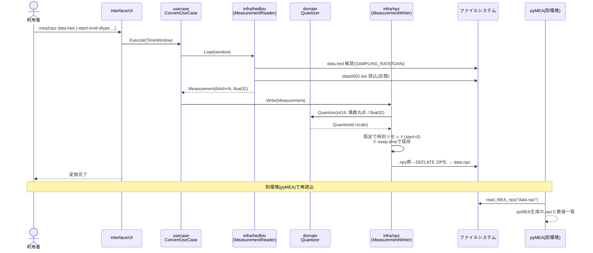
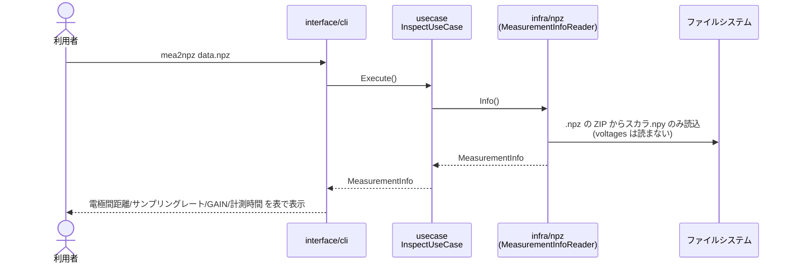

# mea2npz

`.hed`/`.bio` 形式の MEA 計測データを `.npz` へ変換する **Python 非依存の単一バイナリ CLI** です。
出力 `.npz` は pyMEA の `read_MEA_npz` でそのまま読め、pyMEA 生成物と**数値的に一致**します
（int16: 完全一致 / float32: 誤差 < 1 LSB）。

- 📘 **はじめての方へ**: [かんたんマニュアル（初心者向け）](../../docs/mea2npz_manual.md)
- 📋 要件定義: [`docs/prd/mea2npz-cli.md`](../../docs/prd/mea2npz-cli.md)

## インストール

git bash(Windows) / macOS / Linux で、初回に1回だけ実行します（Go/Python 不要）。

```bash
curl -fsSL https://raw.githubusercontent.com/kkito0726/MEA_modules/main/tools/mea2npz/install.sh | bash
```

以降は素のコマンドで使えます。

```bash
mea2npz data.hed
```

> Git for Windows の bash は `$HOME/bin` を自動で PATH に追加するため、新しいシェルを開けば `mea2npz` が使えます。

## 使い方

```bash
mea2npz [options] <input.hed | directory>
mea2npz                                     # 引数なしで対話モード
```

起動時にはツール名の ASCII アートバナー（バージョン・リポジトリ URL 入り）を標準エラー出力へ表示します。
制作者・ライセンスは GNU 風の `-version` で確認できます（バナーは出さないのでスクリプトから安全に参照できます）:

```
$ mea2npz -version
mea2npz 0.1.0
Copyright (C) 2026 kkito0726
License: MIT
Written by kkito0726.
```

引数なしで実行すると**対話モード**になり、入力パス・dtype・読み込み時間の指定有無・電極間距離・
時刻リセット・（ディレクトリ時）再帰探索を順に尋ねます（各項目は Enter で既定値）。
「読み込み時間を指定する」を選んだ場合は開始秒・終了秒を必須で入力します。フラグを覚えなくても変換できます。

| オプション | 既定 | 内容 |
|---|---|---|
| `-o <path>` | 入力と同名 `.npz` / ディレクトリは配下 `output/` | 出力先 |
| `-start <sec>` | `0` | 読込開始（秒） |
| `-end <sec>` | ファイル全体 | 読込終了（秒） |
| `-dtype <int16\|float32>` | `int16` | 保存 dtype |
| `-distance <μm>` | `450` | 電極間距離 |
| `-keep-time` | off | 時刻オフセットを保持（既定はリセットして 0s 始まり） |
| `-recursive` | off | ディレクトリを再帰探索 |
| `-jobs <n>` | CPU 数 | 一括変換の並列数 |
| `-version` | — | バージョン表示 |

### 例

```bash
mea2npz data.hed                    # data.npz（0s 始まり, int16）
mea2npz data.hed -start 30 -end 60  # 30-60s を切り出し、0s 始まりで保存
mea2npz data.hed -keep-time         # 元の start/end を保持
mea2npz ./measurements -recursive   # ./measurements/output/ に一括出力
mea2npz data.npz                    # .npz の情報を表形式で表示(変換しない)
```

### .npz の情報表示

`.npz` を渡すと、電極間距離・サンプリングレート・GAIN・計測時間を表で確認できます（pyMEA 生成の `.npz` も可）。

```
$ mea2npz data.npz
ファイル情報: data.npz
┌─────────────────────────┬───────┐
│ 項目                    │ 値    │
├─────────────────────────┼───────┤
│ 電極間距離 (um)         │ 450   │
│ サンプリングレート (Hz) │ 5000  │
│ GAIN                    │ 50000 │
│ 計測時間 (s)            │ 1     │
│ dtype                   │ int16 │
└─────────────────────────┴───────┘
```

ディレクトリ入力では、バリデーション失敗（`.bio` 欠如・区間超過 等）や実行時エラーが
あってもそのファイルをスキップしてログを出し、処理を止めません。末尾に成功/スキップ/失敗の
サマリを表示し、1件でも問題があれば終了コードは非0になります。

## 処理フロー

### 変換（.hed → .npz）



ディレクトリ入力時は `BatchConvertUseCase` が `FileLister` で `.hed` を列挙し、上記の変換を
ファイルごとに並列実行します（失敗はスキップ＋ログで継続）。

### 情報表示（.npz → 表）



## 開発

```bash
cd tools/mea2npz
go test ./...          # テスト
go build ./cmd/mea2npz # ビルド
```

### クロスビルド（手動）

```bash
GOOS=windows GOARCH=amd64 CGO_ENABLED=0 go build -o dist/mea2npz-windows-amd64.exe ./cmd/mea2npz
GOOS=darwin  GOARCH=arm64 CGO_ENABLED=0 go build -o dist/mea2npz-darwin-arm64      ./cmd/mea2npz
GOOS=darwin  GOARCH=amd64 CGO_ENABLED=0 go build -o dist/mea2npz-darwin-amd64      ./cmd/mea2npz
GOOS=linux   GOARCH=amd64 CGO_ENABLED=0 go build -o dist/mea2npz-linux-amd64       ./cmd/mea2npz
```

タグ（`mea2npz-v*`）を push すると GitHub Actions が全 OS 分をビルドして Releases へ添付します。

## アーキテクチャ

DDD / クリーンアーキテクチャ。依存は内向き（`domain ← usecase ← infrastructure/interface`）。

```
cmd/mea2npz            Composition Root（依存注入・起動）
internal/
  domain/              エンティティ・値オブジェクト・量子化・リポジトリポート
  usecase/             変換/一括変換の調停・調停ポート(FileLister/ProgressReporter)
  infrastructure/
    hedbio/            .hed/.bio 読込（domain.MeasurementReader 実装）
    npz/               .npy/.npz 生成（domain.MeasurementWriter 実装）
    fs/                ディレクトリ走査（usecase.FileLister 実装）
  interface/cli/       CLI 引数解析・配線・進捗表示
```

データ読込/書込の抽象は domain 所有のリポジトリポート、フォーマット詳細は infrastructure に隔離。
